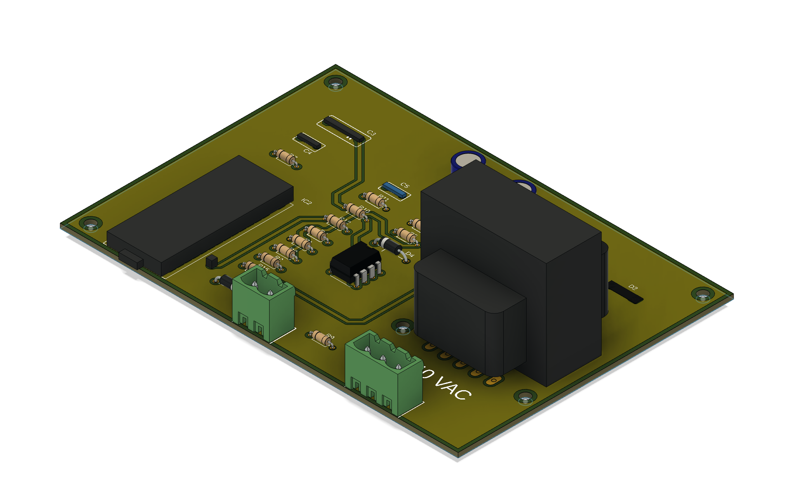

## Summary
The myenergi "Zappi" can regulate an electric car charger so as to balance solar PV generation.  This avoids the purchase of expensive electrical power own solar is available.  The system works well.  

Addition of a house battery is completly possible but, depending on how it is wired, may preference charge/discharge of the car or the house. The Zappi can be configured to change the sequence if desired, provided that the power to/from that bettery is measured.   As supplied the Zappi can only measure AC coupled batteries (such as Tesla Powerwall) but many existing houshold batteries are DC coupled.

This project extracts the battery power reading from a typical DC coupled "hybrid inverter" using a Modbus connection.  This is a data connection only.  It does not interfere with battery or mains power wiring.   The battery power data is convertered into a mains frequency current proportional to the measured power and is applied to the Current Transformer terminals of the Zappi.  This emulates the CT that is present on an AC coupled battery and permits the in-built Zappi controls to operate effectively.

## Warnings
This is a prototype that has worked well for me, so far.   It may not be what you want.

Connection to the inverter via the Modbus interface (RS485) is required.  This is a low voltage connection but is likely to be near to other hazardous components.  Capacitors within the inverter can store sufficient energy to remain **lethal** even if the inverter is isolated from the PV cells and the grid.  Similary the Zappi has a low voltage connection for the CT but nearby components are hazardous.   You must have the necessary skills to identify and manage these hazards. 

I posted this concept in the [myenergi forum](https://myenergi.info/viewtopic.php?p=132908#p132908)   and received a few comments [(and this)](https://myenergi.info/viewtopic.php?p=133013#p133013).  If you are not in a position to analyse these comments and make an informed judgement of your own then this is not the project for you.

## Data from the inverter
A Modbus connection to the Sungrow SH5K-30 inverter is made using a Raspberry Pi 4B with a [RS485 HAT](https://www.waveshare.com/rs485-can-hat-b.htm) .  This particular HAT galvanically isolates the Raspberry from the RS485 signals.  I have observed significant common mode voltages on the data lines and insist on isolation for my own projects.   

The python script server.py is set to run on startup in /etc/rc.local on the Raspberry Pi.  Tools to monitor the server and to set a fixed output for calibration purposes are included in 'server tools.ipynb'.

At present the Raspberry Pi and HAT are powered by a USB-C plug pack.  A 48VDC (nominal) to 15V converter HAT is in the works so that the server can be powered from the house battery.  This is important if the car charger is wanted during islanding from the grid.

Data is transmitted via WiFi which is also needed at the car charger end and may also need to be available during a power outage.

## CT simulator
The CT simulator is based on an ESP32 that polls the Raspberry server regularly and multiplies this by a sample of the grid voltage.  An analog signal is derived from the ESP32 PMW output which is filtered and AC coupled to an opamp voltage to current converter.  The schematic is included as CT_simulator_schematic.pdf and a rendering of the PCB is shown below.
 

Note the rendering of the PCB does not show the required isolation around the 240VAC terminals.  The prototype PCB was made on a desktop mill and isolation was included at the milling gcode stage.

Once the CT simulator is connected the Zappi the selected terminals should be declared as battery measurement in the Zappi configuration.  Batery power can then read on the myenegi app and calibration_factor in the ESP32 code (line 32) adjusted for best accuracy.  A Jupyter Notebook with a tool to set a fixed output from the server is included.

